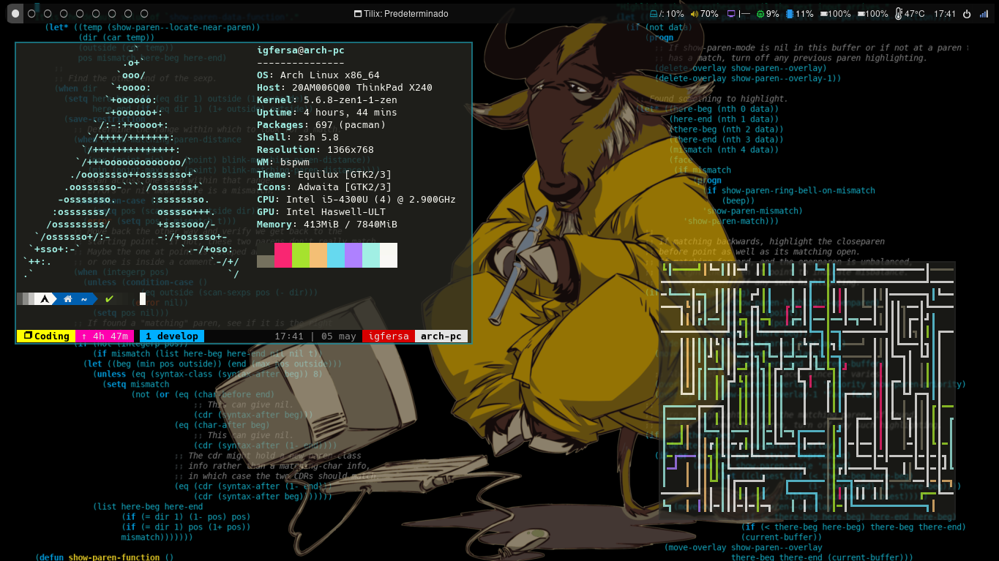
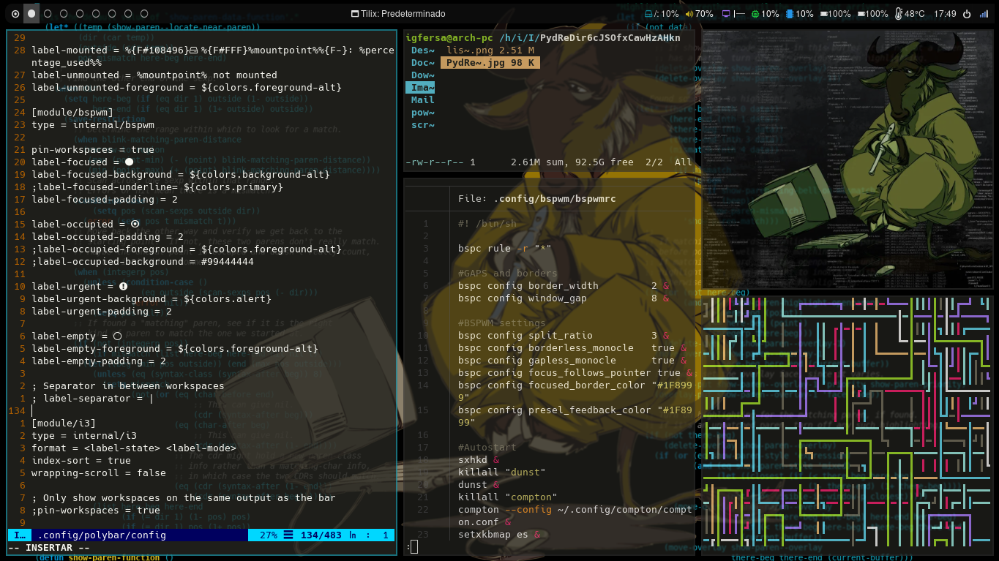

# Preview

# Setup

- [./.config] Settings for:
	- vim/nvim (text editor)
	- zsh (shell)
	- bspwm (window manager)
	- sxhkd (general key binder)
	- polybar (status bar)
	- rofi (window switcher)
	- ranger (file manager)
	- thunar (file manager)
	- tmux (terminal)
	- compton (window compositor)
	- synaptics (general touchpad key binder)
	- dunst (notifications)
	- neofetch (sys information tool)
- [./scripts] Useful scripts
